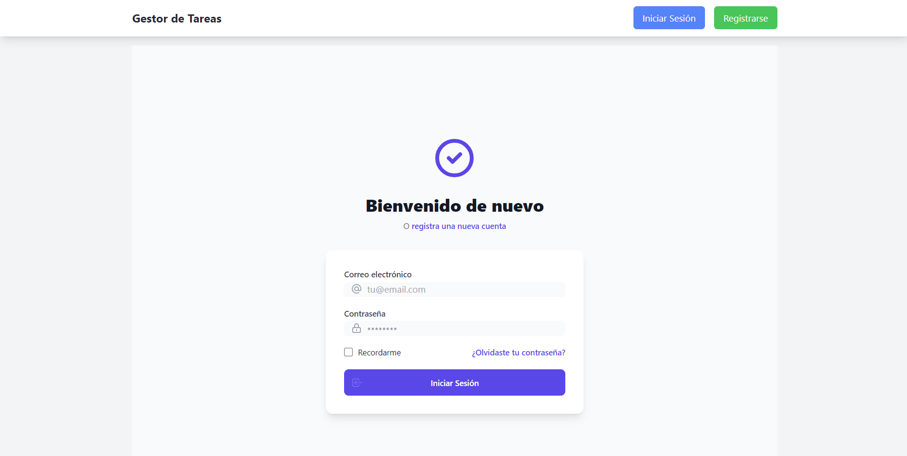
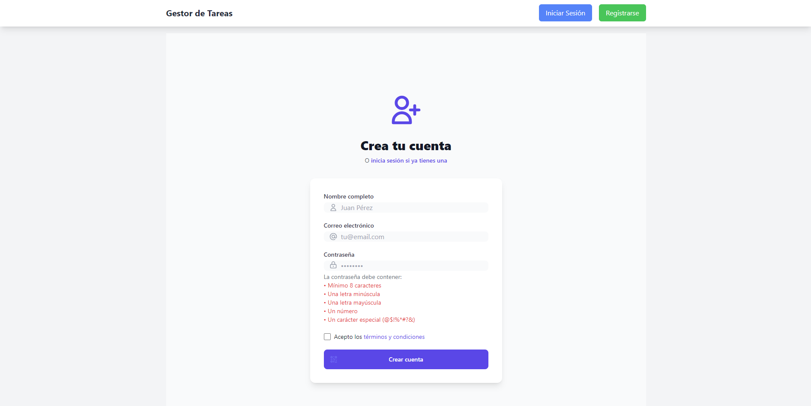
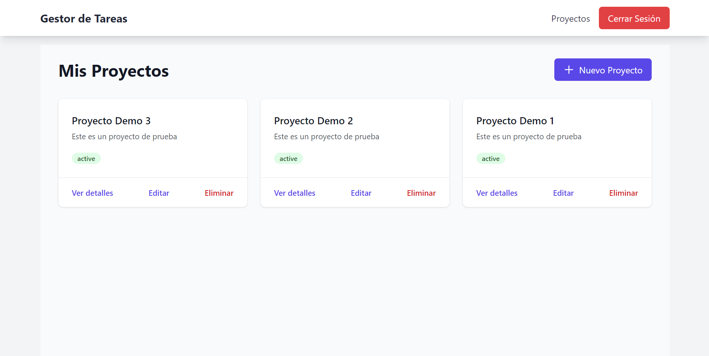
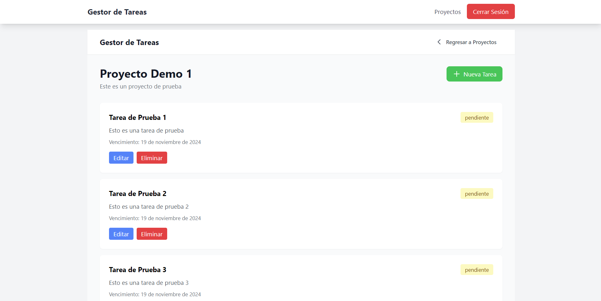

<p align="center"><a href="https://laravel.com" target="_blank"></a></p>

<p align="center">
<a href="https://github.com/laravel/framework/actions"></a>
<a href="https://packagist.org/packages/laravel/framework"></a>
<a href="https://packagist.org/packages/laravel/framework"></a>
<a href="https://packagist.org/packages/laravel/framework"></a>
</p>

# Task Manager - Sistema de Gestión de Tareas

Sistema de gestión de tareas y proyectos desarrollado con Laravel y JWT para autenticación.



## Características

- ✅ Autenticación de usuarios con JWT
- ✅ Gestión de proyectos (CRUD)
- ✅ Gestión de tareas por proyecto (CRUD)
- ✅ API RESTful protegida
- ✅ Interfaz de usuario intuitiva
- ✅ Validaciones en backend y frontend

## Requisitos Previos

- PHP >= 8.1
- Composer
- MySQL
- Node.js y NPM
- XAMPP, WAMP o similar

## Instalación

1. Clonar el repositorio
```bash
git clone [URL_DEL_REPOSITORIO]
cd task-manager
```

2. Instalar dependencias de PHP
```bash
composer install
```

3. Crear y configurar el archivo .env
```bash
cp .env.example .env
```
Configura tu base de datos en el archivo .env:
```
DB_CONNECTION=mysql
DB_HOST=127.0.0.1
DB_PORT=3306
DB_DATABASE=task_manager
DB_USERNAME=root
DB_PASSWORD=
```

4. Generar la clave de la aplicación y JWT
```bash
php artisan key:generate
php artisan jwt:secret
```

5. Ejecutar las migraciones
```bash
php artisan migrate
```

6. Iniciar el servidor
```bash
php artisan serve
```

La aplicación estará disponible en: http://127.0.0.1:8000

## Documentación de la API

### Autenticación

#### Registro de Usuario
```http
POST /api/register

Content-Type: application/json

{
    "name": "Usuario Prueba",
    "email": "usuario@prueba.com",
    "password": "12345678"
}
```

#### Login
```http
POST /api/login

Content-Type: application/json

{
    "email": "usuario@prueba.com",
    "password": "12345678"
}
```

> **Nota**: Guarda el token JWT que recibes del login, lo necesitarás para las siguientes peticiones.

#### Logout
```http
POST /api/logout

Authorization: Bearer {tu_token_jwt}
```

### Proyectos

Todos los endpoints de proyectos requieren el header de autenticación:
```http
Authorization: Bearer {tu_token_jwt}
```

#### Listar Proyectos
```http
GET /api/projects
```

#### Crear Proyecto
```http
POST /api/projects
Content-Type: application/json

{
    "name": "Proyecto Demo",
    "description": "Este es un proyecto de prueba"
}
```

#### Ver Proyecto Específico
```http
GET /api/projects/{id}
```

#### Actualizar Proyecto
```http
PUT /api/projects/{id}
Content-Type: application/json

{
    "name": "Proyecto Demo Actualizado",
    "description": "Descripción actualizada"
}
```

#### Eliminar Proyecto
```http
DELETE /api/projects/{id}
```

### Tareas

Todos los endpoints de tareas requieren el header de autenticación y están asociados a un proyecto específico.

#### Listar Tareas de un Proyecto
```http
GET /api/projects/{project_id}/tasks
```

#### Crear Tarea
```http
POST /api/projects/{project_id}/tasks
Content-Type: application/json

{
    "title": "Tarea de Prueba",
    "description": "Esta es una tarea de prueba",
    "due_date": "2024-12-31",
    "status": "pendiente"
}
```

#### Ver Tarea Específica
```http
GET /api/projects/{project_id}/tasks/{id}
```

#### Actualizar Tarea
```http
PUT /api/projects/{project_id}/tasks/{id}
Content-Type: application/json

{
    "title": "Tarea Actualizada",
    "description": "Descripción actualizada",
    "due_date": "2024-12-31",
    "status": "en progreso"
}
```

#### Eliminar Tarea
```http
DELETE /api/projects/{project_id}/tasks/{id}
```

### Códigos de Estado

| Código | Descripción |
|--------|-------------|
| 200/201 | Operación exitosa |
| 401 | No autorizado (token inválido o expirado) |
| 403 | Prohibido (acceso a recursos de otro usuario) |
| 404 | Recurso no encontrado |
| 422 | Error de validación |

## Validaciones

### Usuarios
- Nombre: Solo letras y espacios
- Email: Formato válido y único
- Contraseña: Mínimo 8 caracteres, incluyendo mayúsculas, minúsculas, números y caracteres especiales

### Tareas
- Máximo 5 tareas para el mismo proyecto en una misma fecha por proyecto (no aplica a proyectos)
- No se permiten tareas en fines de semana (aplica solo a tareas)
- Fecha de vencimiento debe ser posterior a hoy

## Seguridad

- Autenticación JWT
- Protección CSRF
- Validación de permisos por usuario
- Encriptación de datos sensibles

## Uso de la Aplicación

1. Registro/Login
   - Crear una cuenta nueva o iniciar sesión
   - El sistema genera un token JWT para autenticación

2. Gestión de Proyectos
   - Crear nuevos proyectos
   - Ver lista de proyectos
   - Actualizar detalles del proyecto
   - Eliminar proyectos

3. Gestión de Tareas
   - Crear tareas dentro de proyectos
   - Establecer fechas de vencimiento
   - Actualizar estado de tareas
   - Eliminar tareas

## Capturas de Pantalla

| Login | Registro |
|-------|----------|
|  |  |

| Lista de Proyectos | Detalles de Proyecto |
|--------------------|---------------------|
|  |  |

## Estructura del Proyecto

```
task-manager/
├── app/
│   ├── Http/
│   │   ├── Controllers/
│   │   └── Middleware/
│   └── Models/
├── database/
│   └── migrations/
├── resources/
│   └── views/
└── routes/
    ├── api.php
    └── web.php
```

## Tecnologías Utilizadas

- Laravel 10
- JWT-Auth
- MySQL
- Tailwind CSS
- Axios

## Contribuir

1. Fork el proyecto
2. Crea tu rama de característica (`git checkout -b feature/AmazingFeature`)
3. Commit tus cambios (`git commit -m 'Add some AmazingFeature'`)
4. Push a la rama (`git push origin feature/AmazingFeature`)
5. Abre un Pull Request

## Agradecimientos

Este proyecto está construido con [Laravel](https://laravel.com), un framework PHP de código abierto.

## Licencia

The Laravel framework is open-sourced software licensed under the [MIT license](https://opensource.org/licenses/MIT).
